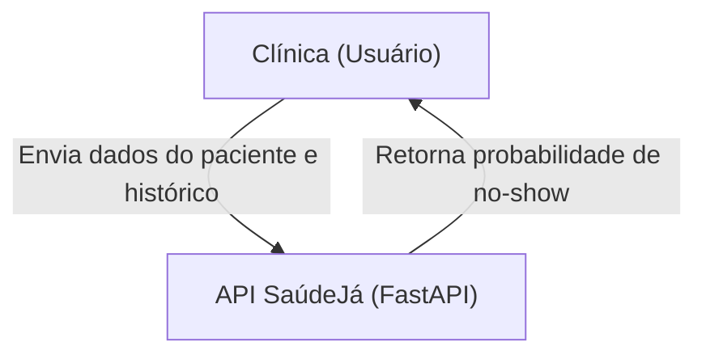
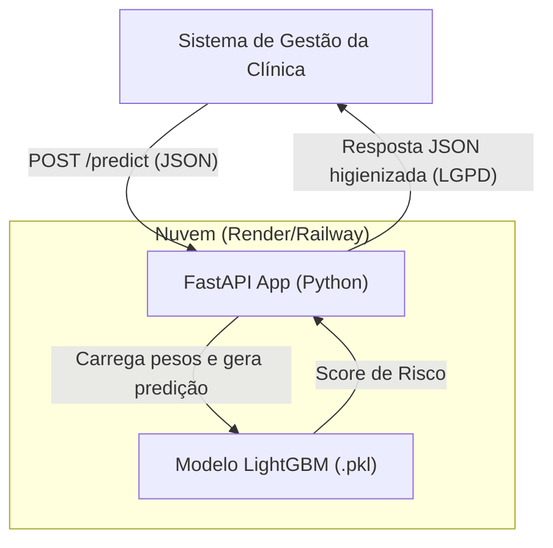

# Diagrama de Arquitetura (Modelo C4)

### Nível 1: Contexto do Sistema (System Context)

```mermaid
flowchart TD
    User["Clínica (Usuário)"]
    System_API["API SaúdeJá (FastAPI)"]
    
    User -- "Envia dados do paciente e histórico" --> System_API
    System_API -- "Retorna probabilidade de no-show" --> User
```

### Nível 2: Contêineres (Containers)

```mermaid
flowchart TD
    User["Sistema de Gestão da Clínica"]
    
    subgraph "Nuvem (Render/Railway)"
        API["FastAPI App (Python)"]
        Model["Modelo LightGBM (.pkl)"]
    end
    
    User -- "POST /predict (JSON)" --> API
    API -- "Carrega pesos e gera predição" --> Model
    Model -- "Score de Risco" --> API
    API -- "Resposta JSON higienizada (LGPD)" --> User
```